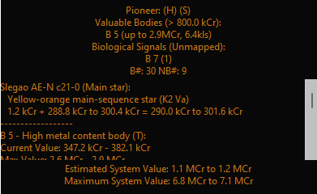

# Pioneer

## Summary

Pioneer is an exploration tool for Elite Dangerous. It utilizes the plugin system of the [Elite Dangerous Market
Connector][EDMC] for backend journal processing and display.

It's focused around providing the most accurate assessment of body values and providing a customizable display to
highlight high value targets.

### Value Calculations
Value calculations include whether a body was previously discovered or mapped, the terraforming bonus (as a likely
range), the efficiency bonus for mapped planets, and any 'first fully scanned / mapped' bonuses you may qualify for.
It factors in the bonus on Odyssey / 4.0+ clients.

### Display
Pioneer will display a number of things. As you progress a few indicators will appear at the top. A honked system will
add a `🌐` tag. Fully scanned systems will add a `🔍` and if none of the bodies had been previously scanned it will
display `🔍🌟`. Similarly, a fully mapped system will display `🗺` or `🗺️🌟`.

Based on a configurable value, the top of the pane will display high value mappable bodies. These will be marked when
terraformable `🌳`, previously scanned `❕🔍`, and previously mapped `❕🗺`. It can also display any bodies with
biological signals. Following this is an optional scrollbox with a detailed breakdown of every system body.

At the top is an estimate of the main star value including the honk bonus provided by all other bodies.
This is followed by a list of scanned bodies, their calculated current and maximum values, and the honk
bonus they provide. At the bottom of the list, it will include any additional bonuses for being the first to fully map
or scan the system.

Finally, the overall current (based on scan and map status) and maximum (if fully mapped) values are
displayed at the bottom of the pane.

### Persistent Data
As of version 2.0, Pioneer now maintains a database of all relevant system data and scan progress. It segments scan and
map status by commander. You can safely stop and restart EDMC without losing your data.

The database management is handled by the [ExploData] plugin/module. See that repository for more details.

### Overlay
As of version 2.1.0, Pioneer now supports an in-game overlay by means of EDMCOverlay. You must enable this in the settings
and install the prerequisite plugin to make use of this feature.

The text color and anchor point for the display are configurable.

## EDSM Parsing
Once per system, data can be parsed from EDSM as an alternative to getting the data in-game. This may save time for
bubble (pre-explored) systems over scanning a nav beacon. Note that EDSM data is not a substitute for scanning and
mapping planets; you will not earn any credits this way. However, it could quickly highlight decently valuable mapping
targets in the bubble.

Note that this should be triggered from the [BioScan] interface if you have both plugins installed.

## Requirements
* EDMC version 5 and above
* (Optional) [ModernOverlay]
  * Alternatively [EDMCOverlay] (Windows) or [edmcoverlay2] (Linux)

## Installation
* Download the [latest release] of both Pioneer and ExploData
  * Appropriate versions of both are available on every release page
  * ExploData has multiple versions depending on how you run EDMC:
    * Users of the prebuilt Windows EXE must use the Windows EXE version of ExploData
    * Flatpak users must use the flatpak version, which is bundled with SQLAlchemy
    * Native python users should use the native python version (see additional instructions below)
  * If you use [BioScan], make sure the version you're using is up-to-date with ExploData
* Extract the `.zip` archives that you downloaded into the EDMC `plugins` folder
  * This is accessible via the plugins tab in the EDMC settings window
  * ExploData must be named as it is packaged, or you will run into trouble loading dependencies
* For native python users:
  * If you use `venv`, install the SQLAlchemy requirement from the `requirements.txt` to the EDMC venv
  * For system python, run `pip install -r requirements.txt` within the ExploData plugin directory to install SQLAlchemy
  * Ensure the correct `pip` is used for your version of EDMC
* (Optional) Install the [ModernOverlay] plugin for overlay support
* Start or restart EDMC to register the plugin and run any necessary database migrations

## Acknowledgements

Core idea and some base calculations originate from the [Economical Cartographics plugin][EcCon] by Nils Steinger.

Value calculations based on [information by MattG](https://forums.frontier.co.uk/threads/exploration-value-formulae.232000/).

## Roadmap

The overall goal is to make this a valuable tool for explorers in Elite Dangerous, highlighting valuable bodies in a
reasonably compact format.

Any reasonably useful info that I can display succinctly could be added. Suggestions are welcome.

One possible project would be to calculate the habitable zone and attempt to estimate the terraform bonus based on that
range. My assumption is that the bonus is highest at the center of this zone. This hasn't been confirmed, but I will use
this to test better value estimates.

## License

[Pioneer plugin][Pioneer] Copyright © 2024 Jeremy Rimpo

Licensed under the [GNU Public License (GPL)][GPLv2] version 2 or later.

[EDMC]: https://github.com/EDCD/EDMarketConnector/wiki
[Pioneer]: https://github.com/Silarn/EDMC-Pioneer
[ExploData]: https://github.com/Silarn/EDMC-ExploData
[BioScan]: https://github.com/Silarn/EDMC-BioScan
[EcCon]: https://github.com/n-st/EDMC-EconomicalCartographics
[ModernOverlay]: https://github.com/SweetJonnySauce/EDMCModernOverlay
[EDMCOverlay]: https://github.com/inorton/EDMCOverlay
[edmcoverlay2]: https://github.com/sersorrel/edmcoverlay2
[latest release]: https://github.com/Silarn/EDMC-Pioneer/releases/latest
[GPLv2]: http://www.gnu.org/licenses/gpl-2.0.html
